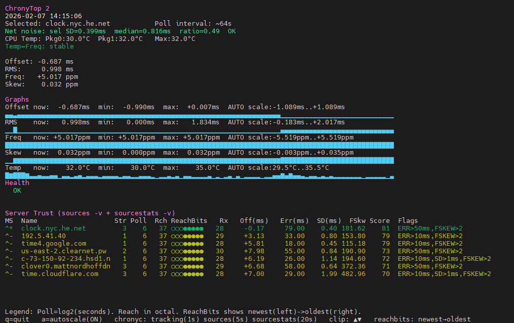

# ChronyTop 2

A real-time terminal monitoring tool for `chrony` time synchronization, inspired by `top`. ChronyTop provides live visualization of clock offset, frequency drift, jitter, and NTP source health with an intuitive ncurses interface.



## Features

### Core Monitoring
- **Real-time tracking metrics**: System time offset, RMS jitter, frequency drift, and skew
- **Live sparkline graphs**: Visual representation of offset, RMS, frequency, and skew over time with optional autoscaling (toggle with `a`)
- **CPU temperature monitoring**: Tracks package temperatures via `coretemp` hwmon sensors with thermal zone fallback and automatic rediscovery
- **Temperature-frequency coupling analysis**: Detects correlations between CPU temperature changes and clock drift
- **Intelligent rate limiting**: Reduces chronyc overhead with cached results (tracking: 1s, sources: 5s, sourcestats: 20s)

### NTP Source Analysis
- **Comprehensive source trust scoring**: Evaluates each NTP source based on:
  - Reachability and staleness
  - Offset magnitude and estimated error
  - Standard deviation from `sourcestats`
  - Frequency skew stability
  - Stratum preference
- **Reach visualization**: 8-bit binary display showing recent poll success history (newest→oldest)
- **Network noise detection**: Compares selected source standard deviation against median to identify outlier conditions
- **Poll interval tracking**: Displays current polling intervals for active sources
- **Sourcestats integration**: Merges `chronyc sources -v` and `sourcestats -v` data for enriched analysis

### Health Monitoring
- **Chronyd daemon monitoring**: Detects when chronyd is down or unreachable
- **Automated alerts**: Warns about large offsets, high jitter, excessive drift, oscillator instability, no reachable/selected sources
- **Time jump detection**: Identifies system time discontinuities and suspend/resume events
- **Color-coded status**: Green/yellow/red indicators for quick health assessment

## Requirements

- **chrony**: The chrony NTP daemon must be installed and running
- **Python 3.6+**: Standard library only (curses, subprocess, time, re, statistics, os, glob)
- **Linux**: Requires sysfs access for CPU temperature monitoring
- **Permissions**: Must be able to execute `chronyc` commands (may require sudo)

## Installation

```bash
# Clone the repository
git clone https://github.com/aimana007/ChronyTop.git
cd chronytop

# Make executable
chmod +x chronytop.py

# Run
./chronytop.py
```

Or install system-wide:

```bash
sudo cp chronytop.py /usr/local/bin/chronytop
sudo chmod +x /usr/local/bin/chronytop
chronytop
```

## Usage

```bash
# Basic usage
./chronytop.py

# If chronyc requires sudo
sudo ./chronytop.py
```

**Controls:**
- `q` - Quit
- `a` - Toggle autoscaling for graphs (default: off, uses fixed scales)
- Updates automatically every second

## How It Works

ChronyTop intelligently polls `chronyc` commands with rate limiting to reduce overhead:
1. `chronyc tracking` - Every 1 second (system clock metrics)
2. `chronyc sources -v` - Every 5 seconds (NTP source status and offsets)
3. `chronyc sourcestats -v` - Every 20 seconds (statistical analysis of sources)

Results are cached between intervals. If a command fails, the previous successful result is retained and displayed with age information.

It also reads CPU package temperatures from:
- `/sys/class/hwmon/hwmon*/` (coretemp sensors, preferred)
- `/sys/class/thermal/thermal_zone*/` (x86_pkg_temp fallback)

If no temperature sensors are initially found, ChronyTop retries discovery every 60 seconds.

## Understanding the Display

### Tracking Metrics
- **Offset**: How far your system clock is from true time (±50ms scale)
- **RMS**: Root mean square of offset measurements (jitter/noise, 0-50ms scale)
- **Freq**: Frequency correction being applied in ppm (±100ppm scale)
- **Skew**: Estimated error in frequency measurement (0-20ppm scale)

### Source Trust Scoring (0-100)
Sources are scored based on multiple factors:
- **80-100**: Excellent - Low jitter, good reachability, selected source
- **55-79**: Fair - Some issues but usable
- **0-54**: Poor - High jitter, unreachable, or stale

**Reach Visualization**: 8 dots showing recent poll attempts (e.g., `●●●●○○○○`)
- `●` = successful poll
- `○` = failed poll
- Left = newest, Right = oldest

**Flags**:
- `UNREACHABLE` - Cannot contact source
- `BAD` - Source marked bad by chrony
- `TOO_VAR` - Too much variance
- `STALE` - Haven't received update recently
- `OFF>Xms` - Offset exceeds threshold
- `SD>Xms` - Standard deviation too high
- `FSKEW>X` - Frequency skew too high
- `FALSETICKER?` - Likely providing incorrect time

### Network Noise Indicator
Compares the selected source's standard deviation against the median of all sources:
- **OK**: Selected source stddev is reasonable
- **ELEVATED**: 2x median + 0.2ms gap
- **OUTLIER**: 3x median + 0.5ms gap (may indicate network issues)

### Health Alerts
- **CHRONYD DOWN / NO DATA**: chronyd daemon not running or not responding
- **NO SOURCES**: No NTP sources configured
- **NO REACHABLE SOURCES**: All configured sources are unreachable
- **NO SELECTED SOURCE**: chronyd hasn't selected a reference source
- **CLOCK STEP / LARGE OFFSET**: Offset >50ms
- **HIGH OFFSET**: Offset >10ms
- **JITTER (RMS HIGH)**: RMS >10ms
- **DRIFT (FREQ HIGH)**: Frequency >100ppm
- **UNSTABLE OSC (SKEW HIGH)**: Skew >5ppm
- **TIME JUMP**: Large sudden offset change
- **SUSPEND/PAUSE DETECTED**: Monotonic clock gap detected
- **STALE DATA**: chronyc commands timing out or returning stale information

## Configuration

### Adjusting Graph Scales
Edit these constants at the top of the script:
```python
OFFSET_SCALE = (-0.050, 0.050)   # ±50ms
RMS_SCALE    = (0.000, 0.050)    # 0-50ms
FREQ_SCALE   = (-100, 100)       # ±100ppm
SKEW_SCALE   = (0, 20)           # 0-20ppm
TEMP_SCALE   = (20.0, 90.0)      # 20-90°C
```

### Adjusting History Window## Configuration

### Graph Scaling Modes

**Fixed Scale (default)**: Press `a` to toggle. Uses predefined scales:
```python
OFFSET_SCALE = (-0.050, 0.050)   # ±50ms
RMS_SCALE    = (0.000, 0.050)    # 0-50ms
FREQ_SCALE   = (-100, 100)       # ±100ppm
SKEW_SCALE   = (0, 20)           # 0-20ppm
TEMP_SCALE   = (20.0, 90.0)      # 20-90°C
```

**Autoscale mode**: Press `a` to toggle. Dynamically adjusts scales based on recent data (2-minute window). Values exceeding the visible range are clipped and indicated with ▲ (above) or ▼ (below) symbols.

### Adjusting Rate Limiting
Edit these constants to change how often chronyc is called:
```python
TRACKING_REFRESH_S    = 1.0   # Track system clock every second
SOURCES_REFRESH_S     = 5.0   # Poll sources every 5 seconds
SOURCESTATS_REFRESH_S = 20.0  # Update sourcestats every 20 seconds
```

### Adjusting History Window
```python
self.history_size = 120  # Number of samples to keep (120 = 2 minutes at 1Hz)
```

### Maximum Source Display
```python
MAX_SRC_ROWS = 7  # Maximum sources shown in trust panel
```

## Troubleshooting

### "chronyc not found / not executable"
- Install chrony: `sudo apt install chrony` (Debian/Ubuntu) or `sudo yum install chrony` (RHEL/CentOS)
- Ensure chronyc is in your PATH
- Try running with sudo: `sudo ./chronytop.py`

### "No sources parsed"
- Check if chronyd is running: `systemctl status chronyd`
- Verify chrony configuration: `cat /etc/chrony/chrony.conf`
- Ensure you have NTP sources configured

### CPU temperature shows "-"
- Not all systems expose temperature sensors via sysfs
- VMs typically don't have temperature sensors
- Check manually: `cat /sys/class/hwmon/hwmon*/name`
- ChronyTop automatically retries sensor discovery every 60 seconds, so if sensors appear later (e.g., after module loading), they'll be detected

## Performance Notes

ChronyTop uses intelligent rate limiting to minimize overhead:
- `chronyc tracking`: polled every 1 second (lightweight, essential)
- `chronyc sources -v`: polled every 5 seconds (moderately expensive)
- `chronyc sourcestats -v`: polled every 20 seconds (expensive, rarely changes)

Failed commands retain previous successful results, so transient issues don't disrupt the display.

For extremely resource-constrained systems, you can:
1. **Increase refresh intervals** in the configuration constants
2. **Disable temperature monitoring**: Comment out `poll_cpu_temps()` call
3. **Reduce update frequency**: Change `time.sleep(1)` to `time.sleep(2)` or higher

## Contributing

Contributions welcome! Areas for improvement:
- Auto-detect optimal graph scales based on system stability
- Configuration file support (YAML/TOML)
- Export/logging capability (JSON, CSV)
- Additional chrony metrics (leap second status, kernel discipline)
- Historical data replay mode
- MacOS support (using different temp sensors)
- Windows support (using w32time instead of chrony)
- Color themes / customizable UI

## License

GPLv2

## Author

Created by AimanA

## Acknowledgments

- Inspired by `top`, `htop`, and similar system monitoring tools
- Built for the `chrony` Linux NTP implementation
- Thanks to the chrony project for excellent time synchronization software
